Comparing Types of Regression Selection
================
Chase Baggett

Introduction
============

I will be testing 3 different techniques for model selection and regularization of models with a high number of predictors. We will look at best subset selection, lasso regression, and ridge regression. We will fit the same data using all 3 models and compare the results.

Data
====

This data comes from a study of 25 patients aged 7-23 years with cystic fibrosis to determine the relationship between maximal expiratory pressure, a measure of the strength of the abdominal muscles and other expiratory muscles, and several other variables related largely to body size and lung function in these patients.

Analyses
========

Exploring the Data
------------------

Immediately, we see strong collinearity between height, age, and weight. This tells me the data likely included children. We also some correlation with our measures of the lungs, which seems to be expected. The collinearity here could make coefficient estimation difficult.

``` r
ggpairs(cystfibr)
```

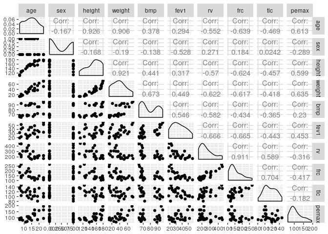 We were specifically asked to look at the relationship between sex and body mass, which I have done, but I am not seeing anything particularly surprising. What is far more surprising is the bimodal nature of body mass. There are no samples of men or women with a body mass between 75 and 85, despite it being the apparent center of the data.

``` r
ggplot(cystfibr,aes(y=sex,x=bmp)) + 
  geom_point() + 
  geom_smooth(method="loess") + 
  ggtitle("Sex vs Body Mass")
```

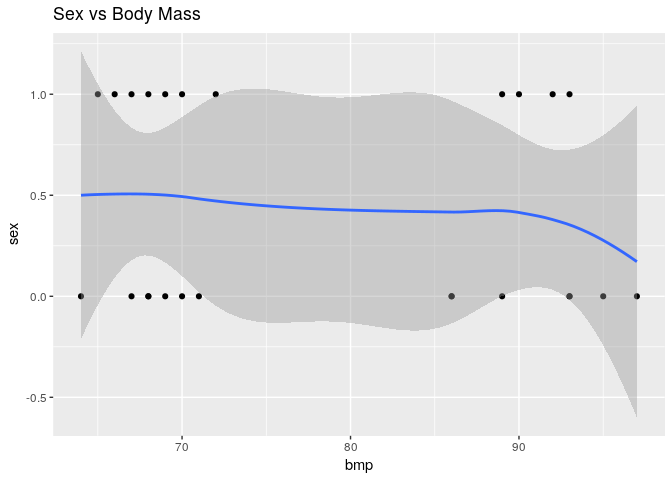

What I do find interesting, however, is the relationship between Sex and fev1. It seems that fev1, the forced expiratory volume, would be a decent predictor of sex. Separating the effect of fev1 as opposed to sex could be challening.

``` r
ggplot(cystfibr,aes(y=sex,x=fev1)) + 
  geom_point() + 
  geom_smooth(method="loess") + 
  ggtitle("Sex vs Forced Expiratory Volume")
```

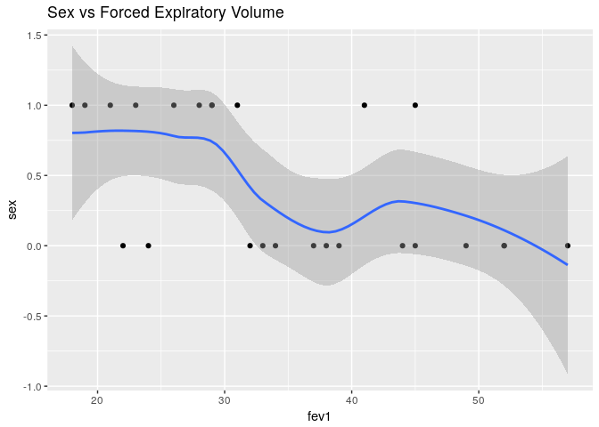

But after a little digging, I discovered the real cause, which is seen below. The test is very non-random. They have males between 10 and 20 in the experiment, but females only in a much smaller age range. This could present a serious problem for test prediction because Sex will seem to describe many of the things that are collinear with age to some degree.

``` r
ggboxplot(data = cystfibr,x = "sex",y="age")
```

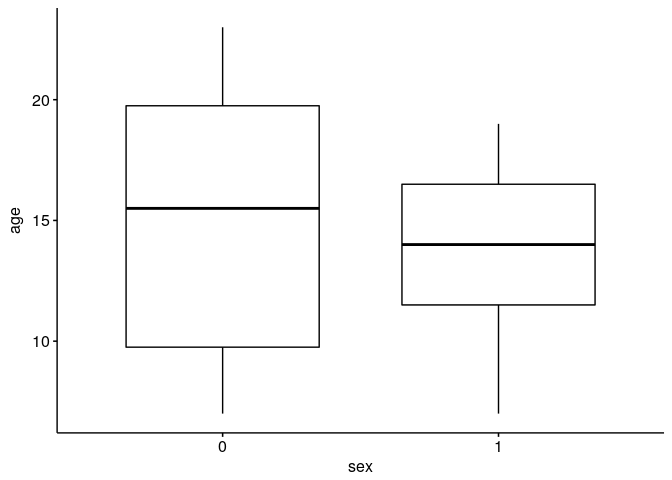

Train and Test
--------------

All three modesl will use the same training/test split of 80/20.

``` r
set.seed(1)
train_idx <- sample(c(TRUE,FALSE), nrow(cystfibr),rep=TRUE,prob = c(.8,.2))

train <- cystfibr[train_idx,]
test <- cystfibr[!train_idx,]

y = train$pemax
x = model.matrix(pemax ~.,train)
```

Best Subset Slection
--------------------

Best subsets is often computationally impractical, but with our small dataset and few predictors, it won't be a problem. It will help us identify the best set of predictors amongst the many we have.

First, we fit a best subsets model, and look at how RSS changes as the number of coefficients change. As we know to be true, RSS continues to decline as Predictors are added. BIC and Cp both provide optimum values with 3 predictors, but Adjusted *R*<sup>2</sup> is optimal with 4, which suggests that 4 might be overfitting.

``` r
bestsubset.fit = regsubsets(pemax ~.,cystfibr)
bestsubset.summary = summary(bestsubset.fit)
bestsubset.overview <- data.frame(RSS=bestsubset.summary$rss,
                                  AdjR=bestsubset.summary$adjr2,
                                  Cp=bestsubset.summary$cp,
                                  BIC=bestsubset.summary$bic
                                  )

bestsubset.overview$Predictors <- 1:nrow(bestsubset.overview)
ggplot(melt(bestsubset.overview,id.vars = "Predictors"),aes(x=Predictors,y=value)) +
  geom_line() + 
  facet_wrap(~variable,scales = "free")
```

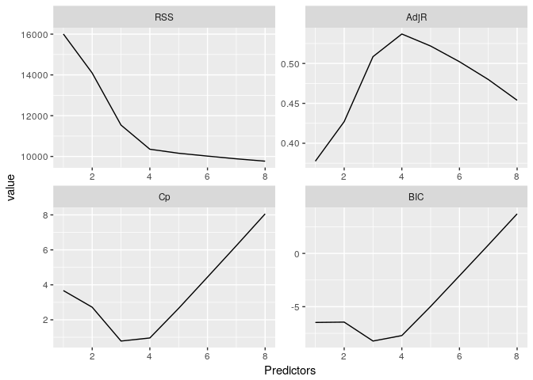

Here, we can see the best subset model with 3 variables includes weight,bmp and fev1.

``` r
bestsubsets.models <- as.data.frame(bestsubset.summary$which)
datatable(bestsubsets.models)
```

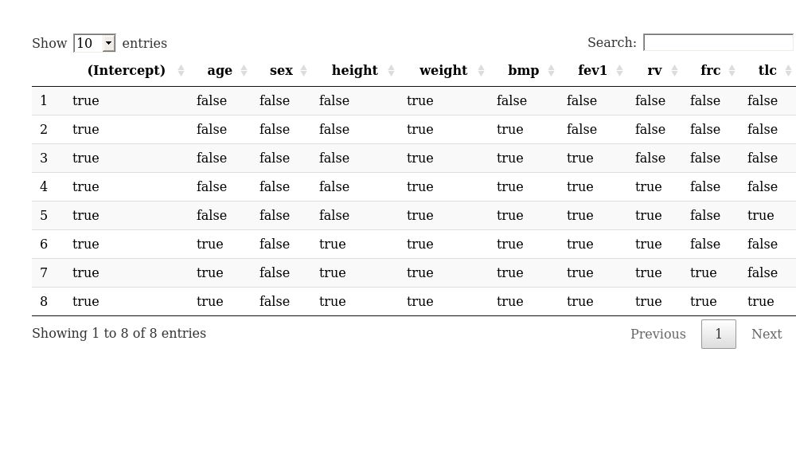

``` r
bestsubset.final_model <- lm(pemax ~ weight + bmp + fev1,data=train)
```

Here we can see an overview of the model's performance.

``` r
glance(bestsubset.final_model)
```

    ##   r.squared adj.r.squared    sigma statistic     p.value df    logLik
    ## 1 0.6101269     0.5370257 23.22924  8.346331 0.001439975  4 -89.05558
    ##        AIC      BIC deviance df.residual
    ## 1 188.1112 193.0898 8633.565          16

As well as the coefficients.

``` r
tidy(bestsubset.final_model)
```

    ##          term   estimate  std.error statistic     p.value
    ## 1 (Intercept) 132.069727 38.1069436  3.465765 0.003185741
    ## 2      weight   1.378192  0.4118419  3.346411 0.004098187
    ## 3         bmp  -1.559751  0.6796309 -2.294997 0.035593774
    ## 4        fev1   1.452322  0.6672733  2.176502 0.044840489

Lasso Regression
----------------

Lasso regression is similar to best subsets in that it can be used to perform variable selection by using a lambda value to reduce coefficients to zero. We will compare its selection to that of bestsubsets. We will find the best value of lambda via cross validation.

We can see that the lasso method returned different variables. Our Lasso was built with cross-validation to pick the right value of *λ*, whereas our subset selection was built with the training set all at once.

With Lasso regression, we end up keeping many more of our coefficient in the model, with only a few being set to zero. Specifically, height, age, and sex were removed.

``` r
set.seed(1)
lasso.fit = glmnet(x,y,alpha=1)
lasso.cvfit = cv.glmnet(x,y,alpha=1)
lasso.coef = predict(lasso.fit,type = "coefficients",s = lasso.cvfit$lambda.min)
datatable(data.frame(name = lasso.coef@Dimnames[[1]][lasso.coef@i + 1], 
           coefficient = lasso.coef@x))
```

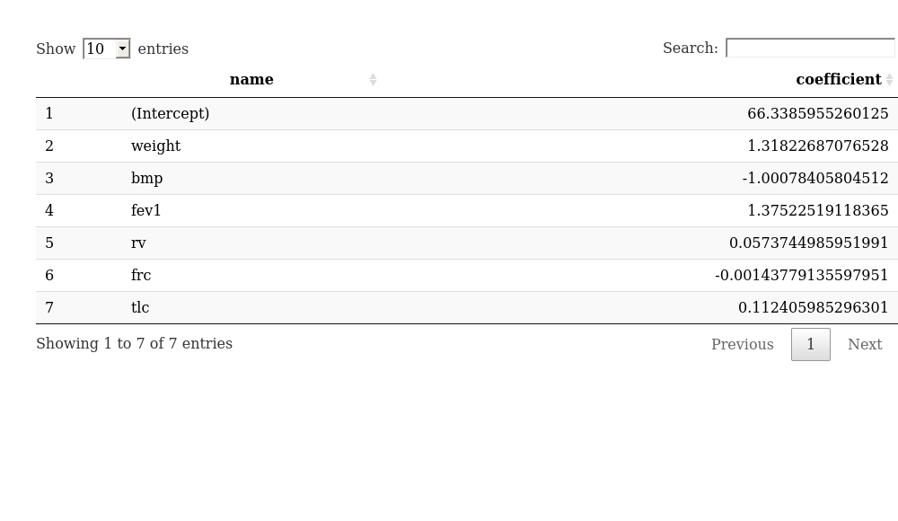 We can use the broom package to visualize the lambda we've chosen compared o other options, with the minimum lambda as a solid line, and one standard error lambda as a dashed line.

``` r
lasso.tidy <- tidy(lasso.cvfit)
lasso.glance <- glance(lasso.cvfit)
ggplot(lasso.tidy, aes(lambda, estimate)) + geom_line(color = "red") +
    geom_ribbon(aes(ymin = conf.low, ymax = conf.high), alpha = .2) +
    scale_x_log10() +
    geom_vline(xintercept = lasso.glance$lambda.min) +
    geom_vline(xintercept = lasso.glance$lambda.1se, lty = 2)
```

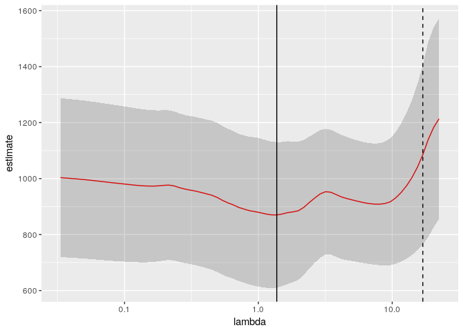

Ridge Regression
----------------

Unlike lasso and best subset, ridge regression cannot be used for outright variable selection on its own, as the ridge will reduce the coefficients near sometimes, but never actually to zero. Ridge should be expected to be more logical for designed experiments where there is a strong first principle reason to believe most of the predictors have an effect on the response.

We will fit a ridge regression to the training set and compare it to lasso and best subset. We will see that every variable remains in the model. In fact, age, which was dropped by both of the other models, ends up with the second largest coefficient by absolute value.

``` r
set.seed(1)
ridge.fit = glmnet(x,y,alpha=0)
ridge.cvfit=cv.glmnet(x,y,alpha=0)
ridge.coef = coef(ridge.fit,s=ridge.cvfit$lambda.min)
datatable(data.frame(name = ridge.coef@Dimnames[[1]][ridge.coef@i + 1], 
           coefficient = ridge.coef@x))
```

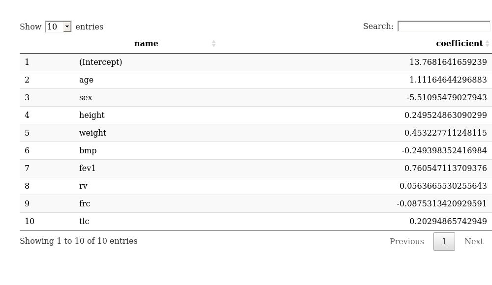 We will also visualize the lambda selection for ridge regression.

``` r
ridge.tidy <- tidy(ridge.cvfit)
ridge.glance <- glance(ridge.cvfit)
ggplot(ridge.tidy, aes(lambda, estimate)) + geom_line(color = "red") +
    geom_ribbon(aes(ymin = conf.low, ymax = conf.high), alpha = .2) +
    scale_x_log10() +
    geom_vline(xintercept = ridge.glance$lambda.min) +
    geom_vline(xintercept = ridge.glance$lambda.1se, lty = 2)
```

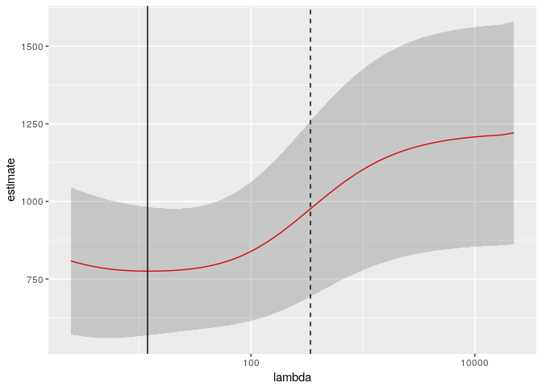

Conclusion
==========

Now, I am going to take each of the 3 models and test them against our test set. Our test set is pretty much tiny because we are working with so little data to begin with, but it is a good exercise. We, in fact, only have 5 records.

These are our actual predictions on the test set.

``` r
x_test = model.matrix(pemax ~.,test)

test$BestSubset <- predict(bestsubset.final_model,newdata = test)
test$Lasso <- predict(lasso.fit,newx = x_test,s = lasso.cvfit$lambda.min)
test$Ridge <- predict(ridge.fit,newx = x_test,s = ridge.cvfit$lambda.min)

results <- test[,c("pemax","BestSubset","Lasso","Ridge")]
colnames(results) <- c("Actual","Best Subset","Lasso","Ridge")
datatable(results)
```

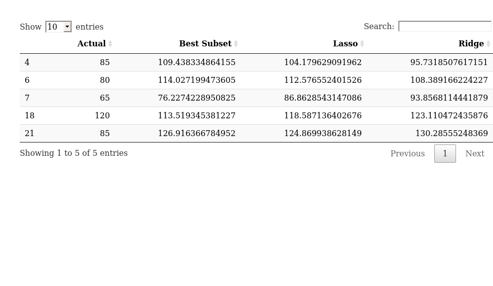

The best test set MSE comes from lasso regression. However, I did try rerunning the entire experiment with different seeds and found that the models tended to change rank slightly. If I had to pick a model I would use lasso. I beleive many variables are measuring similar things, such as age, weight, height body mass all measuring the same thing. I also would want to understand why there is the age vs sex discrepency in the data.

``` r
mse1 <- sum((results$Actual - results$`Best Subset`)^2)
mse2 <- sum((results$Actual - results$Ridge)^2)
mse3 <- sum((results$Actual - results$Lasso)^2)
datatable(data.frame(Models=c("Best Subset","Ridge","Lasso"),MSE=c(mse1,mse2,mse3)))
```

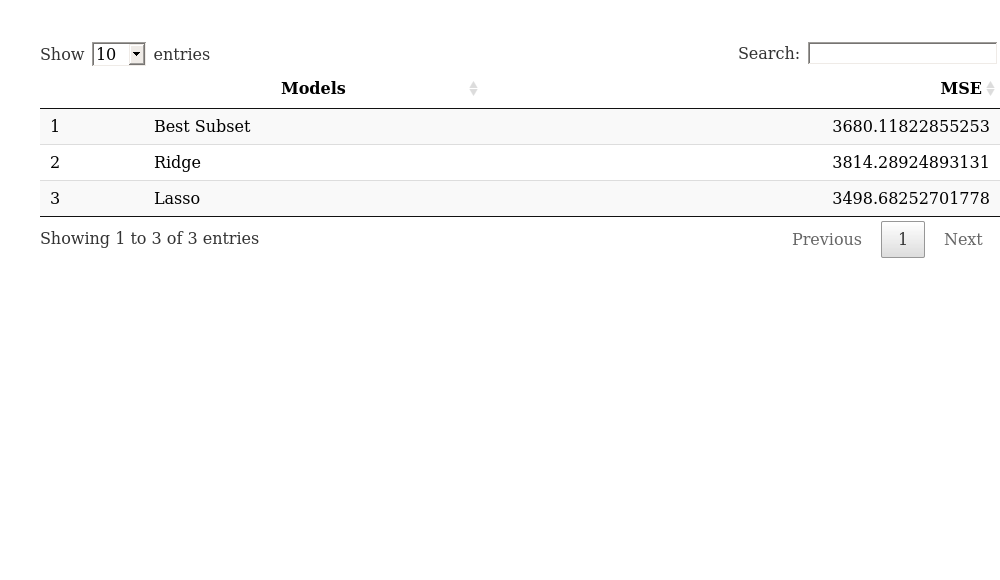
